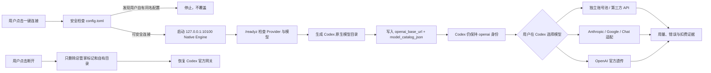

# Codex Total Manager / Codex 总管家

> 把 Codex 的模型、独立账号出口、皮肤、本机网关、外部 Worker 和服务器状态集中到一个 Windows 桌面面板中管理。


Codex 总管家不是另一个聊天客户端，也不会替换 Codex。它是一个运行在本机的控制面：
默认与 Codex 断开；只有用户点击“一键连接 Codex”并确认后，才把本机网关和模型目录写入 Codex 配置。
断开时只删除总管家自己拥有的内容。

当前版本为 **3.0.0-rc.25 候选版**。隔离构建、安全测试、假上游端到端请求和
10 万条账本压力矩阵已经通过；真实 Codex、真实 OAuth 账号池和皮肤仍需在专用测试电脑完成最终验收，
因此现在不能称为生产稳定版。

## 它解决什么问题

当模型来源、账号出口和本机工具越来越多时，常见问题不是“缺一个转发器”，而是：

- 模型散落在不同来源，Codex 原生模型菜单里看不到或名字冲突；
- 切换模型时脚本自动点击界面，失败后却误报成功，甚至要求重启 Codex；
- 从官方 Pro 模型切到第三方模型后，`previous_response_id` 无法被上游识别，聊天像突然失忆；
- 多个 OAuth 账号混在同一出口，无法确定下一次请求到底由哪个账号扣费；
- 皮肤、Worker、服务器状态和本机端口分别由不同脚本维护，出错后很难判断是哪一层；
- 工具为了“方便”覆盖用户原配置，断开时又无法精确恢复。

总管家把这些能力放进同一个有明确边界的 Windows 应用，并让所有高风险操作失败关闭。

## 主要功能

### Codex 原生模型目录

- 使用 Codex 官方支持的 `model_catalog_json` 生成启动模型目录；
- 保留 Codex 内置 `openai` Provider 身份，只通过 `openai_base_url` 接入本机 Native Engine；
- OpenAI 官方模型保留原名称，第三方模型统一显示为 `provider/model`，避免同名串线；
- 不再自动点击 Codex 的模型菜单，也不会自动关闭或重启 Codex；
- 当前任务需要切换时，由用户在 Codex 自己的模型菜单中选择，结果更可验证。

### Responses 对话连续性

- 识别 `previous_response_id`；
- 对无法识别 Codex Response ID 的 Chat、Anthropic、Google 等路由，在本机内存中展开上一轮完整消息；
- 续接状态有 2 小时 TTL、128 条上限、单条 1 MB 和总计 16 MB 上限；
- 不保存 Authorization Header、API Key 或账号凭据；Native Engine 退出后自动清空。

### 账号池和独立出口

- 官方 Codex 主账号走原生透传；
- 每个 CLIProxyAPI 账号池使用独立本机端口、独立 Provider 身份和独立凭据槽；
- 同一个 CLIProxyAPI 出口检测到多个授权文件时失败关闭，避免账号串用；
- 账号、模型、配额和请求结果分别记录，不能仅凭“切换按钮成功”断言真实扣费账号；
- 401/403、429、上游错误和模型错误分开归类，便于定位登录失效、限流和路由问题。

> 说明：候选版不伪造不存在的原生 Codex 账号。Native Engine 当前只把官方主账号作为原生透传入口；
> 额外账号应通过独立 CLIProxyAPI 出口接入，真实扣费仍要用下一条请求日志确认。

### 皮肤、Worker 与状态面板

- 内置 Codex Dream Skin 资源和在线应用通道；
- 支持恢复官方界面，缺失资源或版本不匹配时拒绝伪造“应用成功”；
- `delegate_to_worker` 统一管理外部 Worker 的角色、模型、来源、单价、预算、超时和审计；
- 展示本机 Native Engine、Unified Gateway、皮肤通道、v2rayN 和服务器健康状态；
- 服务器监控需要用户明确配置，仓库不包含服务器地址、SSH 密钥或代理链接。

## 工作流程



## 安全设计

- **默认断开**：首次启动不会让 Codex 经过总管家；
- **保留原生身份**：不再写入旧的 `model_provider = "cmm_native"`；
- **所有权标记**：配置块、模型目录和缓存失效文件只有仍带总管家标记时才会删除；
- **冲突停手**：用户已有 `openai_base_url`、`model_catalog_json` 或显式选择其他 Provider 时拒绝覆盖；
- **原子写入**：配置和目录先写临时文件，再一次性替换，失败不留下半个文件；
- **本机限定**：Native Engine 和网关仅监听 `127.0.0.1`；管理接口必须携带本机 Admission Token；
- **凭据隔离**：敏感值使用 Windows CurrentUser DPAPI，源码和日志不得保存明文；
- **不自动重启 Codex**：模型目录未刷新时只提示用户手动重新打开，不代替用户操作真实 Codex。

完整报告规则见 [SECURITY.md](SECURITY.md)。

## 端口说明

| 默认端口 | 作用 | 是否对外开放 |
| --- | --- | --- |
| `10100` | Native Engine；Codex Responses/模型路由和管理 API | 否，仅 `127.0.0.1` |
| `10110` | Unified Gateway；外部 Worker 和统一路由入口 | 否，仅 `127.0.0.1` |
| `9335` | 皮肤实时应用/CDP 通道 | 否，仅本机，按需开启 |
| 用户配置 | v2rayN 本机代理端口 | 总管家不强制固定端口 |

v2rayN 不是 Native Engine 的启动前置条件。没有启用代理的 Provider 可以直接工作；
确实需要代理的来源按用户自己的 v2rayN 配置连接。

## 安装与使用

### 候选包

1. 从 GitHub Releases 下载与版本对应的 Windows `win-x64` 候选包；
2. 核对 Release 页面公布的 SHA-256；
3. 解压后启动“Codex 总管家”；
4. 先添加模型来源或独立账号出口；
5. 确认主页的 Native Engine 和 `/readyz` 正常；
6. 需要 Codex 使用时，再点击“一键连接 Codex”；
7. 如果正在运行的 Codex 没刷新模型列表，由用户手动重新打开一次；
8. 在 Codex 原生模型菜单中选择目标模型。

在专用测试电脑安装普通候选包时，需要明确标记这是测试机：

```powershell
powershell.exe -NoProfile -ExecutionPolicy Bypass -File .\install-local-release.ps1 -IsolatedTestMachine
```

安装脚本会先逐个核对清单、版本、Node.js 签名和 CLIProxyAPI 固定哈希。普通候选包必须保持
“默认断开、应用内确认后才可连接”；永久隔离包则从程序层面禁止接触真实 Codex。两种声明混乱时都会拒绝安装。

当前仓库还没有发布可称为稳定版的安装包。不要把 `out/`、`bin/` 或历史候选目录当成正式 Release。

### 从源码构建

要求：Windows 10/11、.NET SDK `10.0.302`，以及发布阶段显式提供的哈希锁定 CLIProxyAPI 文件。

```powershell
dotnet build CodexTotalManager.sln --no-restore -c Debug
dotnet test tests\CodexModelManager.SecurityTests\CodexModelManager.SecurityTests.csproj --no-build -c Debug
.\build.ps1 -Publish -Version 3.0.0-rc.25
```

生成永久隔离、不能连接真实 Codex 的测试包：

```powershell
.\build.ps1 -Publish -DetachedOnly -Version 3.0.0-rc.25
```

## 测试边界

当前 rc.25 已验证：

- Debug 全解决方案编译：0 错误、0 警告；
- 30 项安全测试；
- 隔离单元/集成矩阵；
- 10 万条账本冷启动和追加压力测试；
- 589 文件候选包清单校验，以及安装回路“只验包、不安装”测试；
- 本机假 Responses/Chat 上游的两轮连续对话；
- `/healthz` 存活与 `/readyz` 就绪分离；
- 第三方 `provider/model` 原生目录、连接/断开往返和旧 `cmm_native` 安全迁移。

这些结果不能代替真实 Codex、真实 OAuth、真实皮肤版本和真实扣费账号的业务验收。
测试替身成功也不等于 OpenAI 官方服务已经认可这一候选版。

## 与其他工具的区别

| 能力 | 普通 API 转发器 | OpenCodex 类原生模型接入 | Codex 总管家 |
| --- | ---: | ---: | ---: |
| API/模型路由 | ✅ | ✅ | ✅ |
| Codex 原生模型目录 | 通常没有 | ✅ | ✅ |
| 保留 `openai` 身份的一键连接/断开 | 通常没有 | 视项目而定 | ✅ |
| 独立账号出口与扣费证据 | 部分 | 部分 | ✅ |
| Responses 跨协议对话续接 | 部分 | 部分 | ✅ |
| 皮肤管理 | ❌ | ❌ | ✅ |
| Worker 预算与审计 | ❌ | ❌ | ✅ |
| 本机服务与服务器状态面板 | ❌ | ❌ | ✅ |

总管家吸收了原生模型接入项目中“让 Codex 自己认识模型”的思路，但目标不是做一个单纯转发器，
而是把接入、账号边界、可恢复配置和运维状态放进同一控制面。

## 常见问题

### 为什么切换模型后当前聊天没有马上变化？

总管家不再自动点击 Codex 界面。它会准备模型目录和默认模型；当前任务请在 Codex 自己的模型菜单中选择。
如果列表仍旧，手动重新打开 Codex 让它重新读取启动目录。

### 为什么不能覆盖我原来的自定义网关？

因为总管家无法判断那条网关是否承载你的旧任务。覆盖它可能让历史任务失去原 Provider 身份，
所以遇到用户自有配置会停止，并把冲突说清楚。

### 账号不同会影响 GitHub 上传吗？

浏览器登录账号与本地开发账号可以不同；公开仓库任何账号都能读取。
但真正上传代码的 GitHub 账号必须是仓库所有者，或被所有者添加为有写权限的 Collaborator。

### 总管家会上传聊天或服务器信息吗？

不会。仓库和默认日志不应包含聊天正文、Token、OAuth 文件、SSH/VLESS 配置或服务器身份。
Provider 请求只发送给用户明确配置的上游。

## 参与项目

欢迎提交脱敏后的 Bug 复现、界面建议、Provider 适配和文档改进。
公开 Issue 中请勿粘贴 Token、Cookie、账号文件、服务器地址或完整日志。

如果这个项目解决了你的 Codex 多模型或多账号管理问题，欢迎点一个 Star，
并在 Issue 中告诉我们你最需要优先验收的模型来源。

## 许可证与第三方组件

**项目所有者尚未为整个仓库选择开源许可证。** 公开可见不等于允许复制、商用或重新分发。
正式公开发布前，需要在 MIT、Apache-2.0 或其他许可证中做出明确选择并添加根目录 `LICENSE`。

CLIProxyAPI、Codex Dream Skin 等第三方组件仍受各自许可证约束；发布包必须保留对应许可证、版本和来源说明。
