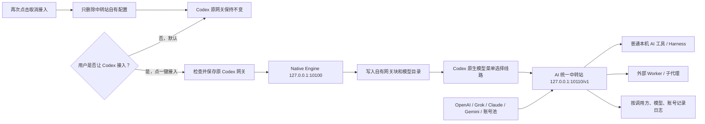

# AI Gateway Manager / AI 中转站总管家

> 把 OpenAI、Grok、Claude、Gemini 等上游 API、模型线路、账号池、调用方和请求记录集中到一个 Windows 桌面中转站；Codex 接入只是其中一个可选功能。


AI 中转站总管家不是另一个聊天客户端。它的主功能是本机统一中转：把多个上游模型接入同一个
`http://127.0.0.1:10110/v1`，供本机 AI 工具、Worker 和其他明确配置的调用方使用。即使完全不连接 Codex，
中转站、上游 API、独立调用方密钥和请求账本也可以单独使用。

Codex 是可选客户端，默认断开。只有用户点击“一键让 Codex 接入中转站”并确认后，软件才写入自己拥有的
本机网关和模型目录；再次点击会恢复原网关。整个过程不自动关闭或重启 Codex。

当前版本为 **3.0.0-rc.29 候选版**。隔离构建、安全测试、假上游端到端请求和
10 万条账本压力矩阵已经通过；真实 Codex、真实 OAuth 账号池和皮肤仍需在专用测试电脑完成最终验收，
因此现在不能称为生产稳定版。

## 它解决什么问题

当模型来源、账号出口和本机工具越来越多时，常见问题不只是“缺一个转发器”，而是：

- OpenAI、Grok、Claude、Gemini 等来源的 URL、协议和密钥分散在不同工具里；
- 多个本机工具各用一套地址和钥匙，无法统一停用、记账或查出实际走了哪条线路；
- 模型散落在不同来源，接入 Codex 时原生模型菜单里看不到或名字冲突；
- 切换模型时脚本自动点击界面，失败后却误报成功，甚至要求重启 Codex；
- 从官方 Pro 模型切到第三方模型后，`previous_response_id` 无法被上游识别，聊天像突然失忆；
- 多个 OAuth 账号混在同一出口，无法确定下一次请求到底由哪个账号扣费；
- 皮肤、Worker、服务器状态和本机端口分别由不同脚本维护，出错后很难判断是哪一层；
- 工具为了“方便”覆盖用户原配置，断开时又无法精确恢复。

AI 中转站总管家把这些能力放进同一个有明确边界的 Windows 应用，并让高风险操作失败关闭。

## 主要功能

### AI 统一中转站

- 统一 Base URL：`http://127.0.0.1:10110/v1`；
- 提供 `/responses`、`/chat/completions` 和 `/models`；
- 第三方 API 一律使用 `来源编号/模型`，不会生成容易撞名的裸模型；
- 每个调用方可发放独立 API Key（`--gateway-key-create/list/revoke`），可单独记账和吊销；
- 每次请求写入 `unified-gateway-request-log.jsonl`，记录调用方、模型、实际账号、状态和结果；
- 中转站只监听 `127.0.0.1`，不会自动暴露到局域网或公网；
- 接入 DSH、opencode、Trae 等工具的方法见 [docs/HARNESS-INTEGRATION.md](docs/HARNESS-INTEGRATION.md)。

### 内置主流模型来源模板

- 原生提供 OpenAI API、xAI Grok、OpenRouter、DeepSeek、Anthropic Claude、Google Gemini、Mistral、Groq、
  通义千问、Moonshot/Kimi、Perplexity 和 Together AI 模板；
- 选择模板只会填写公开 Base URL、协议和建议上下文，不会内置、下载或收集任何 API Key；
- OpenAI 开发者平台 API Key 与 ChatGPT/Codex 套餐登录互相独立；
- xAI Grok 直接使用官方 `api.x.ai` Responses API，不读取网页 Cookie，也不复制第三方项目的固定客户端身份；
- LiteLLM、New API、One API、LocalAI 等自建网关继续通过“自定义 / 自建统一网关”接入；
- Anthropic 使用原生 `x-api-key`，Google 使用原生 `x-goog-api-key`，其余 OpenAI 兼容来源使用 Bearer；
- 模板和协议边界见 [docs/PROVIDER-PRESETS.md](docs/PROVIDER-PRESETS.md)。

### 可选功能：一键接入 Codex

- 默认不接入 Codex，首页和“Codex 接入”页都有同一个一键开关；
- 连接前显示当前 Codex 网关和连接后的本机网关，断开时显示将恢复的原网关；
- 使用 Codex 官方支持的 `model_catalog_json` 生成启动模型目录；
- 保留 Codex 内置 `openai` Provider 身份，只通过用户级 `openai_base_url` 接入本机 Native Engine；
- OpenAI 官方模型保留原名称，第三方模型统一显示为 `provider/model`，避免同名串线；
- 不自动点击 Codex 的模型菜单，也不会自动关闭或重启 Codex；
- 当前任务需要切换时，由用户在 Codex 自己的模型菜单中选择。

### Responses 对话连续性

- 识别 `previous_response_id`；
- 对无法识别 Codex Response ID 的 Chat、Anthropic、Google 等路由，在本机内存中展开上一轮完整消息；
- 续接状态有 2 小时 TTL、128 条上限、单条 1 MB 和总计 16 MB 上限；
- 不保存 Authorization Header、API Key 或账号凭据；Native Engine 退出后自动清空。

### 账号池和独立出口

- 官方 Codex 主账号走原生透传；
- 每个 CLIProxyAPI 账号池使用独立本机端口、独立 Provider 身份和独立凭据槽；
- 同一个 CLIProxyAPI 出口检测到多个授权文件时失败关闭，避免账号串用；
- 账号、模型、配额和请求结果分别记录，不能仅凭“切换按钮成功”断言真实扣费账号；
- 401/403、429、上游错误和模型错误分开归类，便于定位登录失效、限流和路由问题。

> 说明：候选版不伪造不存在的原生 Codex 账号。Native Engine 当前只把官方主账号作为原生透传入口；
> 额外账号应通过独立 CLIProxyAPI 出口接入，真实扣费仍要用下一条请求日志确认。

### Codex 授权池：codex-auto 轮换

- `codex-auto/<模型>` 把多个 Codex 账号池的同一模型聚合成一个稳定模型名：哪个账号有额度用哪个，
  429（尊重 Retry-After）、401/403、5xx 自动冷却当前账号并切到下一个；全部冷却时 503 并提示恢复时间；
- 轮换候选每次请求前都重新执行与精确路由相同的服务端来源与凭据校验；响应头 `X-CMM-Served-By` 标出实际扣费账号；
- 带 `previous_response_id` 的 Responses 对话有会话粘性：同一对话尽量锁定同一账号，避免换号续聊失忆；
- 精确路由（`cli/号池/模型` 等）行为不变，适合把某个任务钉死在指定账号；

### 皮肤、Worker 与状态面板

- 内置 Codex Dream Skin 资源和在线应用通道；
- 支持恢复官方界面，缺失资源或版本不匹配时拒绝伪造“应用成功”；
- `delegate_to_worker` 统一管理外部 Worker 的角色、模型、来源、单价、预算、超时和审计；
- 展示本机 Native Engine、Unified Gateway、皮肤通道、v2rayN 和服务器健康状态；
- 服务器监控需要用户明确配置，仓库不包含服务器地址、SSH 密钥或代理链接。

### 自定义插件

- 支持把天气查看等独立 Windows 小程序作为插件文件夹放入运行数据目录；
- 插件通过 `plugin.json` 声明名称、版本、入口、参数和网络/文件等能力；
- 初次发现默认关闭，用户检查发布者、能力与文件指纹后才能启用；
- 插件包内任意文件变化会自动撤销旧授权，路径逃逸、符号链接、未知清单字段和重复 ID 均被拒绝；
- 插件作为独立进程运行，崩溃不会直接拖垮总管家，输出和退出码会显示在插件页；
- 总管家不会主动把 Codex、账号池、OAuth、API Key 或服务器配置传给插件。

进程隔离不等于 Windows 安全沙盒：恶意插件仍可能主动访问当前用户可访问的文件或网络。
只启用可信插件；完整格式与开发说明见 [docs/EXTENSIONS.md](docs/EXTENSIONS.md)。

### 软件中心与 Windows 集成

- 首次启动先显示安全说明，Codex 仍保持默认断开；
- 提供关于、版本、隐私边界、许可证状态和 GitHub 项目入口；
- 可选择登录 Windows 后自动打开，以及最小化/关闭时进入系统托盘；
- 托盘菜单提供重新打开、进入软件中心和“完全退出”，不会让用户误以为程序已经退出；
- 手动检查 GitHub Release，不静默下载、不静默安装，也不把源码分支冒充正式更新；
- 可打开用户数据和诊断目录，并复制不含用户名、完整路径、账号、Cookie、Token、API Key、服务器地址和聊天内容的诊断摘要；
- 安装后登记到 Windows“已安装的应用”，并创建开始菜单、卸载入口和桌面快捷方式；卸载默认保留用户数据，只有明确选择彻底清理才会删除。

## 工作流程



## 安全设计

- **默认断开**：首次启动不会让 Codex 经过总管家；
- **保留原生身份**：不再写入旧的 `model_provider = "cmm_native"`；
- **所有权标记**：配置块、模型目录和缓存失效文件只有仍带总管家标记时才会删除；
- **冲突停手**：用户已有 `openai_base_url`、`model_catalog_json` 或显式选择其他 Provider 时拒绝覆盖；
- **原子写入**：配置和目录先写临时文件，再一次性替换，失败不留下半个文件；
- **本机限定**：Native Engine 和网关仅监听 `127.0.0.1`；管理接口和独立调用必须携带本机 Admission Token；
- **Codex 会话准入**：Codex 自己的 ChatGPT Bearer 只能先访问 OpenAI 官方透传；只有一次官方上游请求成功后，同一会话才可访问第三方路由。随便填写的 Bearer 会被拒绝；内存只保存令牌的 SHA-256，最多 8 条、8 小时，引擎退出即清空；
- **凭据隔离**：敏感值使用 Windows CurrentUser DPAPI，源码和日志不得保存明文；
- **不自动重启 Codex**：模型目录未刷新时只提示用户手动重新打开，不代替用户操作真实 Codex。

完整报告规则见 [SECURITY.md](SECURITY.md)。
Windows 软件化能力和稳定版前仍需完成的门槛见 [docs/PRODUCT-READINESS.md](docs/PRODUCT-READINESS.md)。

## 端口说明

| 默认端口 | 作用 | 是否对外开放 |
| --- | --- | --- |
| `10100` | Native Engine；Codex Responses/模型路由和管理 API | 否，仅 `127.0.0.1` |
| `10110` | Unified Gateway；外部 Worker 和统一路由入口 | 否，仅 `127.0.0.1` |
| `9335` | 皮肤实时应用/CDP 通道 | 否，仅本机，按需开启 |
| 用户配置 | v2rayN 本机代理端口 | 总管家不强制固定端口 |

v2rayN 不是 Native Engine 的启动前置条件。没有启用代理的 Provider 可以直接工作；
确实需要代理的来源按用户自己的 v2rayN 配置连接。

## 安装与使用

### 候选包

1. 从 GitHub Releases 下载与版本对应的 Windows `win-x64` 候选包；
2. 核对 Release 页面公布的 SHA-256；
3. 解压后使用包内 `install-local-release.ps1` 校验并安装；不要绕过清单直接运行 EXE；
4. 先添加模型来源或独立账号出口；
5. 确认主页的统一中转站 URL、模型目录和 API Key 状态正常；
6. 需要 Codex 使用时，再点击“一键让 Codex 接入中转站”；
7. 如果正在运行的 Codex 没刷新模型列表，由用户手动重新打开一次；
8. 在 Codex 原生模型菜单中选择目标模型。

在专用测试电脑安装普通候选包时，需要明确标记这是测试机：

```powershell
powershell.exe -NoProfile -ExecutionPolicy Bypass -File .\install-local-release.ps1 -IsolatedTestMachine
```

安装脚本会先逐个核对清单、版本、Node.js 签名和 CLIProxyAPI 固定哈希。普通候选包必须保持
“默认断开、应用内确认后才可连接”；永久隔离包则从程序层面禁止接触真实 Codex。两种声明混乱时都会拒绝安装。

当前仓库还没有发布可称为稳定版的安装包。不要把 `out/`、`bin/` 或历史候选目录当成正式 Release。

### 从源码构建

要求：Windows 10/11、.NET SDK `10.0.302`，以及发布阶段显式提供的哈希锁定 CLIProxyAPI 文件。

```powershell
dotnet build CodexTotalManager.sln --no-restore -c Debug
dotnet test tests\CodexModelManager.SecurityTests\CodexModelManager.SecurityTests.csproj --no-build -c Debug
.\build.ps1 -Publish -Version 3.0.0-rc.29 `
  -CliProxyApiArtifactPath 'C:\path\to\verified\cli-proxy-api.exe' `
  -NodeArtifactPath 'C:\path\to\node.exe' `
  -NodeLicensePath 'C:\path\to\Node.js\LICENSE'
```

生成永久隔离、不能连接真实 Codex 的测试包：

```powershell
.\build.ps1 -Publish -DetachedOnly -Version 3.0.0-rc.29 `
  -CliProxyApiArtifactPath 'C:\path\to\verified\cli-proxy-api.exe' `
  -NodeArtifactPath 'C:\path\to\node.exe' `
  -NodeLicensePath 'C:\path\to\Node.js\LICENSE'
```

`-Publish` 会自动运行安全测试和集成自检；不需要另加 `-Test`。脚本会把
`-CliProxyApiArtifactPath` 仅在集成自检进程期间传入测试，并在结束后恢复原环境变量。
该文件必须匹配源码锁定的版本和 SHA-256，否则构建会在发布前失败关闭。

## 测试边界

当前 rc.29 源码已验证：

- Release 全解决方案编译：0 错误、0 警告；
- 当前安全测试集全部通过（准确数量以 `dotnet test` 当次输出为准，避免文档数字再次过期），其中包含本机准入、官方会话验证、流式工具调用、第三方模型接入、正式发布证据门槛、跨进程配置防覆盖、软件版本比较与脱敏诊断，以及通用插件的禁用默认值、路径边界、整包指纹、确认期间换包拦截、参数传递、环境变量隔离和崩溃隔离；
- 隔离单元/集成矩阵；
- 10 万条账本冷启动和追加压力测试；
- 候选包清单和安装回路“只验包、不安装”逻辑测试；本地候选仍不等于已发布的 GitHub Release；
- 本机假 Responses/Chat 上游的两轮连续对话；
- 本机假 Anthropic/Google 上游、工具调用和第三方统一网关端到端转发；
- `/healthz` 存活与 `/readyz` 就绪分离；
- 第三方 `provider/model` 原生目录、连接/断开往返和旧 `cmm_native` 安全迁移。

这些结果不能代替真实 Codex、真实 OAuth、真实皮肤版本和真实扣费账号的业务验收。
测试替身成功也不等于 OpenAI 官方服务已经认可这一候选版。

### 正式发布门槛

本机构建、安全测试和隔离集成测试全部通过，最多只能把候选包标记为
`READY_FOR_EXTERNAL_BUSINESS_VALIDATION`，不能直接写成 `DEPLOYABLE`。
正式晋级还必须在专用测试电脑上完成真实 Codex 验收，并把证据绑定到这份候选包的
`payload-manifest.json` SHA-256。必测项目包括官方/第三方消息、两类工具调用、对话连续性、
账号池切换、真实扣费归属、Codex 不被重启、皮肤兼容和断开后配置精确恢复。

证据格式见 [docs/REAL-CODEX-ACCEPTANCE.example.json](docs/REAL-CODEX-ACCEPTANCE.example.json)。
缺少任意一项，`scripts/emit-evidence.ps1 -MarkDeployable` 都会失败关闭并保持候选状态；
单独传一个开关不能再伪造“正式可部署”。
生成证据时还必须通过 `-CliProxyApiArtifactPath` 提供与构建相同、哈希锁定的 CLIProxyAPI 测试文件；
脚本只在集成测试子进程期间临时传入，测试后立即恢复原环境变量。

### 账本长期保存

当前按 UTC 月份分文件，但旧月份不会自动删除。旧文件不只是普通日志，还保存历史总数、
账号归属、防重复证据和崩溃恢复依据；直接删掉或只留一个汇总会造成历史缩水或重复计费。
安全压缩必须做到压缩前后总数完全一致、旧事件重导仍能识别为重复、任意阶段崩溃都能回滚，
并通过第二个进程重新打开验证。完整门槛见 [docs/LEDGER-RETENTION.md](docs/LEDGER-RETENTION.md)。
这些测试完成以前，总管家选择“多占一点磁盘，也不自动删错账”。

从旧 `usage.jsonl` 升级到总管家自己的 `request-log.jsonl` 时，旧账原样保留，新日志在升级点建立
一次性基线；只归账基线之后新追加的请求。这样不会把两个格式不同的历史日志硬猜成同一请求，
也不会把历史用量再算一遍。旧游标会改名保留为本地迁移证据，不会写入安装包或 GitHub。

## 与其他工具的区别

| 能力 | 普通 API 转发器 | OpenCodex 类原生模型接入 | AI 中转站总管家 |
| --- | ---: | ---: | ---: |
| API/模型路由 | ✅ | ✅ | ✅ |
| Codex 原生模型目录 | 通常没有 | ✅ | ✅ |
| 保留 `openai` 身份的一键连接/断开 | 通常没有 | 视项目而定 | ✅ |
| 独立账号出口与扣费证据 | 部分 | 部分 | ✅ |
| Responses 跨协议对话续接 | 部分 | 部分 | ✅ |
| 皮肤管理 | ❌ | ❌ | ✅ |
| Worker 预算与审计 | ❌ | ❌ | ✅ |
| 本机服务与服务器状态面板 | ❌ | ❌ | ✅ |

AI 中转站总管家以统一 API、上游线路、调用方钥匙和请求账本为主，同时吸收了原生模型接入项目中
“让 Codex 自己认识模型”的思路。Codex 接入是可选模块，不是整个软件的前置条件。

## 常见问题

### 为什么切换模型后当前聊天没有马上变化？

总管家不再自动点击 Codex 界面。它会准备模型目录和默认模型；当前任务请在 Codex 自己的模型菜单中选择。
如果列表仍旧，手动重新打开 Codex 让它重新读取启动目录。

### 为什么不能覆盖我原来的自定义网关？

因为总管家无法判断那条网关是否承载你的旧任务。覆盖它可能让历史任务失去原 Provider 身份，
所以遇到用户自有配置会停止，并把冲突说清楚。

### 账号不同会影响 GitHub 上传吗？

浏览器登录账号与本地开发账号可以不同；公开仓库任何账号都能读取。
但真正上传代码的 GitHub 账号必须是仓库所有者，或被所有者添加为有写权限的 Collaborator。

### 总管家会上传聊天或服务器信息吗？

不会。仓库和默认日志不应包含聊天正文、Token、OAuth 文件、SSH/VLESS 配置或服务器身份。
Provider 请求只发送给用户明确配置的上游。

## 参与项目

欢迎提交脱敏后的 Bug 复现、界面建议、Provider 适配和文档改进。
公开 Issue 中请勿粘贴 Token、Cookie、账号文件、服务器地址或完整日志。

如果这个项目解决了你的多模型中转、调用方管理或 Codex 接入问题，欢迎点一个 Star，
并在 Issue 中告诉我们你最需要优先验收的模型来源。

## 许可证与第三方组件

本仓库采用 **MIT 许可证**（见根目录 `LICENSE`）。
CLIProxyAPI、Codex Dream Skin 等第三方组件仍受各自许可证约束；发布包必须保留对应许可证、版本和来源说明。
